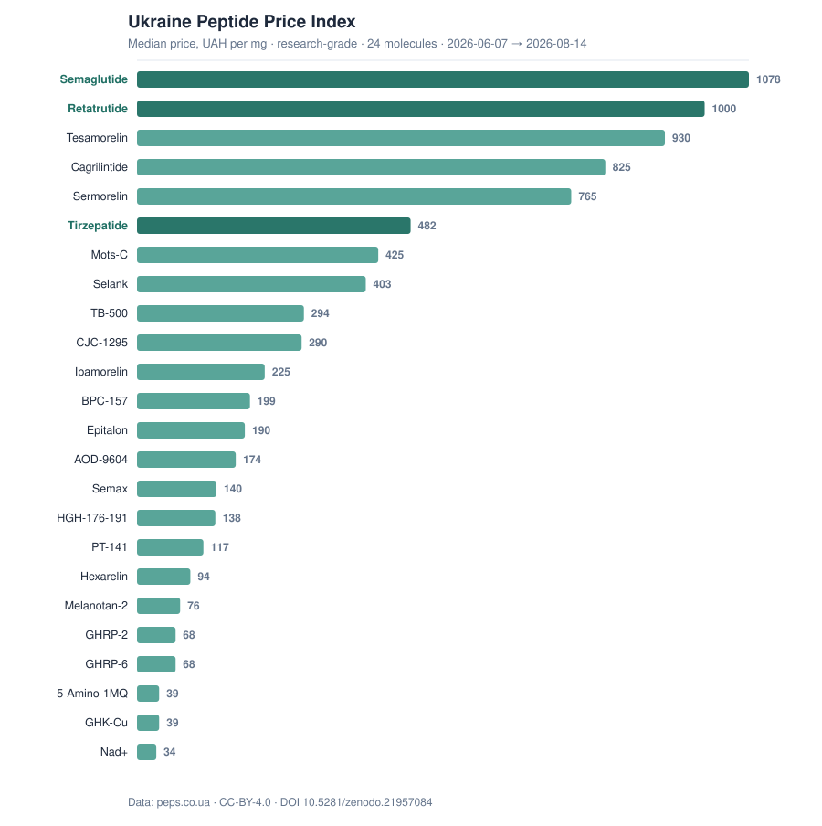

# Ukraine Peptide Price Index

*Median UAH/mg by molecule — click for the live, interactive index at peps.co.ua.*

**The open dataset of research-grade peptide prices on the Ukrainian market, in UAH per milligram.**
Compiled from public storefront listings aggregated by [peps.co.ua](https://peps.co.ua) and released
under **CC-BY-4.0** — free to reuse with attribution.

No other open source tracks peptide prices across the Ukrainian market. This is original,
reproducible research data: real prices from real storefronts, never invented or estimated figures.

> ⚠️ This is **not medical advice** and **not advertising of medicinal products**. The dataset
> covers research-grade compounds only; registered medicines (GLP-1 pens such as Mounjaro, Ozempic,
> Wegovy, Zepbound) are **excluded** from the index. See [`METHODOLOGY.md`](METHODOLOGY.md).

> 🧪 **Alpha (v2).** The aggregation was reworked to remove a frequency bias, but the improvement is
> so far confirmed on **2 of 24 molecules** (retatrutide, tirzepatide). Other values are
> **preliminary**. A formal, fully-validated release follows a ≥500-SKU check. Open limitations are
> listed honestly in [`METHODOLOGY.md`](METHODOLOGY.md).

## What's inside

| File | What it is | Coverage |
|---|---|---|
| [`data/ua-peptide-price-index-current.csv`](data/ua-peptide-price-index-current.csv) | Current snapshot: last known state per molecule (`p25` / `median` / `p75`, suppliers) | 24 molecules · as of 2026-08-15 |
| [`data/ua-peptide-price-index-current.json`](data/ua-peptide-price-index-current.json) | Same snapshot with a `meta` block | — |
| [`data/ua-peptide-price-history-weekly.json`](data/ua-peptide-price-history-weekly.json) | Daily time series per molecule (`p25` / `median` / `p75`) | 1328 rows · 24 molecules · 2026-06-07 → 2026-08-15 |
| [`METHODOLOGY.md`](METHODOLOGY.md) | Full v2 method, exclusions, and honest alpha limitations (Ukrainian) | — |

**Unit:** UAH per 1 mg. **Currency:** UAH. **Method (v2):** one price-state per shop per day (the
shop's cheapest UAH/mg), then `p25` / `median` / `p75` **across shops**; a day is published only with
**≥2 shops**. Both files derive from one v2 source (one method). Only in-stock, research-grade
listings enter the index; per-dose breakdown is temporarily withheld until its method is aligned.

## How to cite

> *Ukraine Peptide Price Index* (v2, alpha) [Data set]. peps.co.ua, 2026.
> CC-BY-4.0. https://doi.org/10.5281/zenodo.21957083

DOI (all versions): [**10.5281/zenodo.21957083**](https://doi.org/10.5281/zenodo.21957083).
A [`CITATION.cff`](CITATION.cff) file is included, so GitHub's **“Cite this repository”** button
produces APA / BibTeX automatically.

## Why this exists

An open, citable price dataset is a **primary source** other people link to and language models
quote — editorial links that cannot be bought. In this niche in Ukraine, nobody else publishes one.
The same data powers the interactive price index on [peps.co.ua/price-index](https://peps.co.ua/price-index).

## Reproducibility

Every figure is generated by a read-only script over the same price table that feeds the website.
Each normalization filter is annotated in code with the reason and a link to the documented scraper
pitfall it guards against. The index carries no hand-edited numbers.

## Limitations (stated honestly)

- These are **storefront** prices, not transaction prices — the actual selling price may differ.
- Coverage depends on which shops are scraped; it is **not** the entire Ukrainian market.
- “research-grade” reflects the shop's own positioning, not independent lab confirmation of each batch.
- Values are rounded to whole UAH per mg.

---

## 🇺🇦 Коротко українською

**Відкритий індекс цін на research-grade пептиди в Україні, у гривнях за 1 мг.** Зібрано з публічних
вітрин магазинів, які агрегує [peps.co.ua](https://peps.co.ua). Ліцензія **CC-BY-4.0** — вільно з
посиланням на джерело.

Це **не** медична порада і **не** реклама лікарських засобів. В індексі — лише research-grade;
зареєстровані ЛЗ (GLP-1 пени) виключені. Жодних вигаданих цифр: якщо числа немає в реальній вітрині,
його немає в індексі. Повна методологія, нормалізація та обмеження — у [`METHODOLOGY.md`](METHODOLOGY.md).

**Як цитувати:** *Ukraine Peptide Price Index, peps.co.ua, 2026. CC-BY-4.0. https://peps.co.ua*
